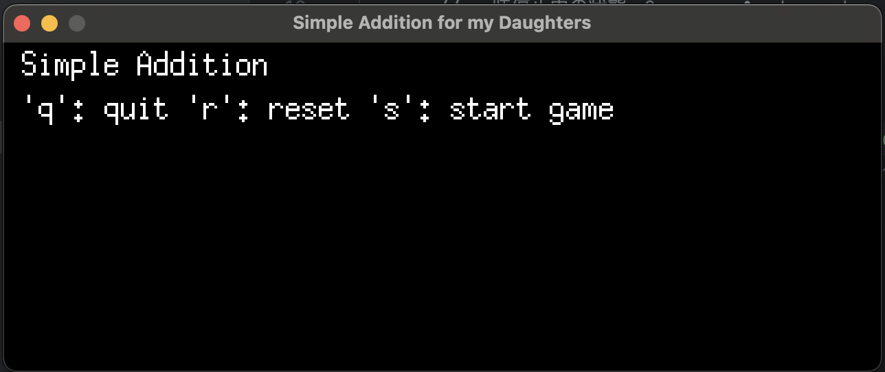
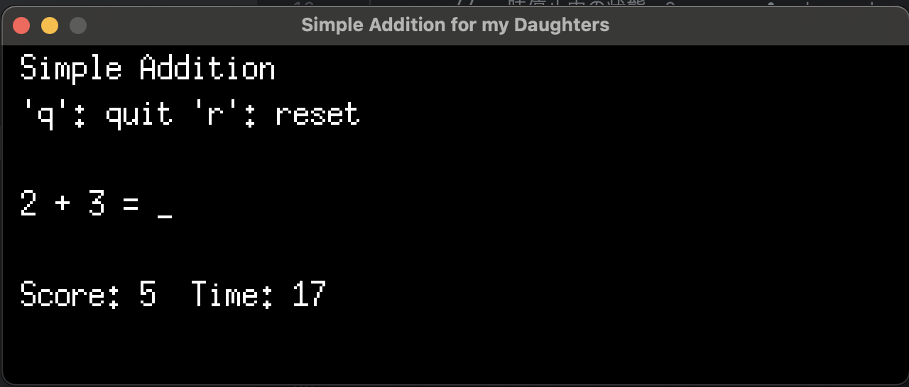

# Simple Addition for My Daughters

Addition Game is a simple, interactive game designed for my daughters.

## Features

- Simple Gameplay: Start the game, and a random addition problem appears. Enter your answer to see if you're correct!
- Score Tracking: Keep track of how many problems you've solved correctly. 
- Time Limit: Race against the clock to solve as many problems as you can before time runs out. 
- Easy Controls: Use your keyboard to interact with the game. Start a new game, submit answers, and more with simple key presses.

## Let's Play!!
### Run
```bash
go run github.com/nakamurakzz/Simple-Addition-for-My-Daughters
```

### How to play
- Start the Game: Press 's' to start the game. 
- Answer Questions: Type your answer using the keyboard and press Enter to submit. 
- Reset the Game: Press 'r' to reset your score and start over. 
- Quit the Game: Press 'q' to quit the game.

## Screen Shots
Before Start


Playing


